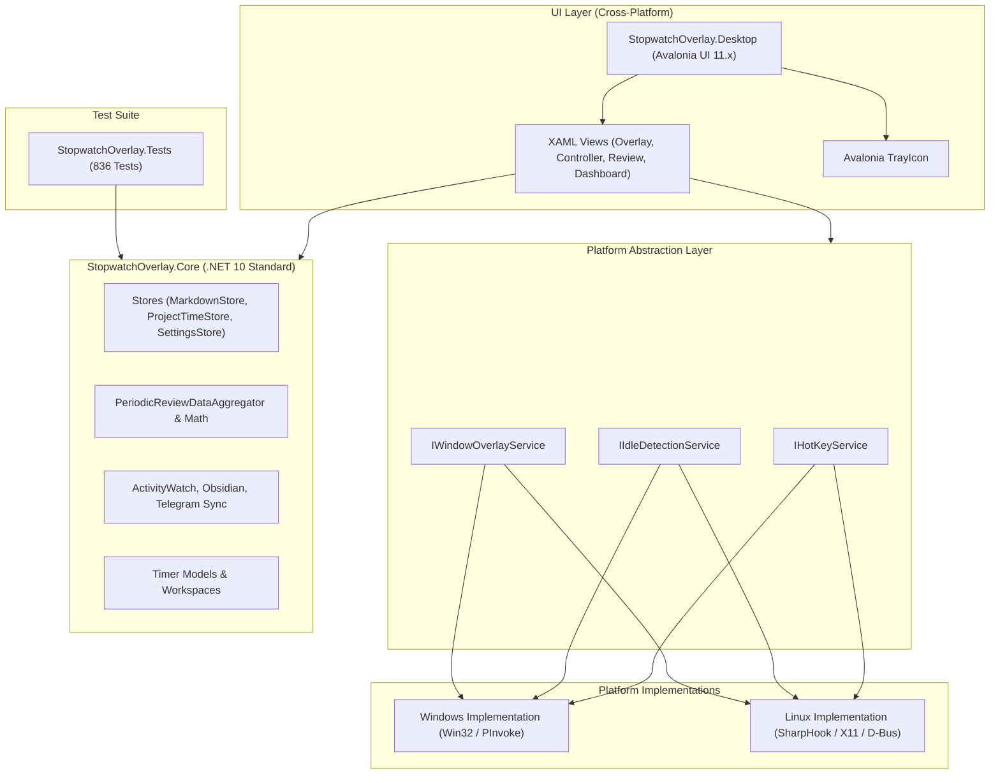

# Cross-Platform Migration Roadmap: Windows & Linux Support
**Project:** Stopwatch Overlay (.NET 10)  
**Target Environments:** Windows (10/11 x64) & Linux (Ubuntu, Debian, Fedora, Arch - X11 & Wayland)  
**Branch:** `feature/cross-platform-linux`

---

## 🤖 Master Prompt for Antigravity

> **How to use this section:**  
> When you start a session with Antigravity to work on this migration, you can copy-paste the prompt block below directly to give Antigravity complete context, guidelines, and execution instructions.

```markdown
You are an expert .NET systems and UI engineer specializing in cross-platform desktop architectures, WPF to Avalonia UI migrations, and Linux desktop integration.

We are migrating the `StopwatchOverlay` project (currently a Windows-only .NET 10 WPF application) to be 100% cross-platform, working natively on both Windows and Linux.

### Repository Context:
- Working Directory: `c:\Users\h128\Documents\Projects\stopwatch-main`
- Active Git Branch: `feature/cross-platform-linux`
- Core Capabilities: Transparent always-on-top stopwatch overlay, global hotkeys (e.g. Win+F2 chord commands), ActivityWatch integration, Markdown timeline and notes sync (Obsidian, Telegram), periodic time review dialogs, and project dashboards.
- Test Suite: 836 xUnit tests in `StopwatchOverlay.Tests`. All existing tests must remain 100% passing at every step.

### Target Architecture:
1. `StopwatchOverlay.Core`: Class Library (.NET 10, cross-platform) containing all data stores, models, sync engines, math aggregators, and settings.
2. `StopwatchOverlay.Platform`: Platform abstraction layer (`IHotKeyService`, `IIdleDetectionService`, `IWindowOverlayService`, `ITrayIconService`) with Windows and Linux implementations.
3. `StopwatchOverlay.Desktop` (Avalonia UI 11.x, .NET 10): Cross-platform XAML interface replacing the Windows-only WPF UI.

### Operating Rules:
- Refer to `CROSS_PLATFORM_ROADMAP.md` for phase and step details.
- Always maintain backwards compatibility: do not break existing Windows functionality while adding Linux support.
- Commit clean, atomic git commits on the `feature/cross-platform-linux` branch after completing each milestone.
- Run `dotnet test` and ensure all unit tests pass before considering any step complete.
```

---

## 1. Executive Summary & Architectural Overview

### Current State (Windows-Only)
- **Framework:** `net10.0-windows` with `<UseWPF>true</UseWPF>` and `<UseWindowsForms>true</UseWindowsForms>`.
- **UI Engine:** WPF (DirectX / `user32.dll` / Win32 `HWND` message loops).
- **System Tray:** `System.Windows.Forms.NotifyIcon`.
- **Display Resolution & Placement:** `System.Windows.Forms.Screen`.
- **Global Hotkeys:** Win32 `RegisterHotKey` / `UnregisterHotKey`.
- **Keyboard Hook (Chords):** Win32 `SetWindowsHookEx` (`WH_KEYBOARD_LL`).
- **User Idle Detection:** Win32 `GetLastInputInfo`.
- **Overlay Window Transparency & Click-Through:** Win32 extended styles (`WS_EX_TRANSPARENT`, `WS_EX_LAYERED`, `SetWindowLongPtr`).

### Target State (Cross-Platform Windows + Linux)
- **Framework:** .NET 10 Standard Desktop runtime (`net10.0`).
- **UI Engine:** **Avalonia UI 11.x** (hardware-accelerated rendering on Windows via DirectX/D3D and Linux via Vulkan/OpenGL/Software).
- **System Tray:** Avalonia native `TrayIcon` (Windows taskbar tray + Linux FreeDesktop / StatusNotifierItem / AppIndicator).
- **Display Placement:** Avalonia `Window.Screens` API (`Screens.All`, `Screens.Primary`).
- **Global Hotkeys & Chords:** **SharpHook** (C# wrapper around `libuiohook` - native support for global key capture on Windows, Linux X11, and Wayland).
- **User Idle Detection:** Dual provider (Win32 on Windows; `xprintidle` / XScreenSaver / D-Bus on Linux).
- **Overlay Transparency & Click-Through:** Avalonia native transparency with OS-specific click-through toggles.



---

## 2. Phased Migration Roadmap

### Phase 1: Core Decoupling & Solution Restructuring
**Goal:** Extract all platform-agnostic business logic, storage engines, sync modules, and math into a pure .NET 10 class library without breaking existing WPF functionality.

- [x] **Step 1.1: Create `StopwatchOverlay.Core` Project**
  - Create directory `StopwatchOverlay.Core`.
  - Create `StopwatchOverlay.Core.csproj` targeting `net10.0`.
  - Add to `StopwatchOverlay.sln`.

- [x] **Step 1.2: Move Platform-Agnostic Files to `StopwatchOverlay.Core`**
  - **Models & Settings:** `AppSettings.cs`, `TimerModels.cs`, `ReviewProjectSelectionItem`, `AppThemeCatalog.cs`, `OverlayThemeCatalog.cs`, `AppUiScale.cs`, `CustomAppBackground.cs`, `TypographySettings.cs`, `SettingsChange.cs`, `NavigatorOpaqueParts.cs`.
  - **Storage & Catalog:** `SettingsStore.cs`, `ProjectTimeStore.cs`, `ProjectTimeHistory.cs`, `TimerWorkspaceStore.cs`, `InternetHistoryStore.cs`, `AppBackgroundCatalog.cs`, `TelegramOutboxStore.cs`.
  - **ActivityWatch & Sync:** `ActivityWatchSync.cs`, `ActivityWatchClient.cs`, `ActivityWatchLauncher.cs`, `ActivityWatchModels.cs`, `ActivityWatchSyncService.cs`, `ObsidianNotesSync.cs`, `ObsidianLogSync.cs`, `TelegramNotesSync.cs`, `InternetLogSync.cs`, `InternetMonitorService.cs`, `InternetSpeedProbe.cs`, `NetworkInfoDetector.cs`.
  - **Periodic Review Aggregator & Analytics:** `PeriodicReviewDataAggregator.cs`, `PeriodicReviewService.cs`, `ProjectDashboardAnalytics.cs`.
  - **Cross-Platform Diagnostics:** `CrashLogger.cs` (with pluggable UI snapshot & theme provider delegates).

- [x] **Step 1.3: Update Dependencies & Verify**
  - Reference `StopwatchOverlay.Core` from `StopwatchOverlay.csproj` (existing WPF app).
  - Reference `StopwatchOverlay.Core` from `StopwatchOverlay.Tests.csproj`.
  - Decouple WPF primitives via `TypographyRgb` and `WpfPlatformInitializer`.
  - Run `dotnet test`: 100% pass (all 836 unit tests passed).
  - Verify Release build: 0 warnings, 0 errors.

---

### Phase 2: Platform Abstraction Layer
**Goal:** Encapsulate OS-dependent operations behind clean C# interfaces with dependency injection or provider factories.

- [x] **Step 2.1: Define Platform Interfaces in `StopwatchOverlay.Core/Platform`**
  - `IHotKeyService` (global shortcuts & chords)
  - `IIdleDetectionService` (user idle detection)
  - `IWindowOverlayService` (always-on-top, click-through transparency)
  - `IStartupService` (sign-in autostart across registry & XDG .desktop)
  - `ISingleInstanceService` (single-instance mutex & unix domain socket)
  - `PlatformServices` (central locator with null-object fallbacks)

- [x] **Step 2.2: Implement Windows Providers**
  - `WindowsIdleDetectionService` (Win32 `GetLastInputInfo`)
  - `WindowsStartupService` (HKCU Run key registry)
  - `WindowsOverlayService` (`SetWindowLong`, `WS_EX_TRANSPARENT`, `WS_EX_TOOLWINDOW`, `WS_EX_NOACTIVATE`)
  - `WindowsSingleInstanceService` (named Mutex & EventWaitHandle)
  - Registered via `WpfPlatformInitializer` at application startup.

- [x] **Step 2.3: Implement Linux Providers**
  - `LinuxStartupService` (XDG Autostart `~/.config/autostart/*.desktop`)
  - `LinuxIdleDetectionService` (`xprintidle` / session idle query)
  - `LinuxSingleInstanceService` (Unix Domain Socket IPC & file lock)

---

### Phase 3: Avalonia UI Setup & Asset Migration
**Goal:** Initialize the Avalonia UI desktop project, port themes, styles, brush palettes, and vector assets.

- [x] **Step 3.1: Create `StopwatchOverlay.Desktop` Project**
  - Target: `<TargetFramework>net10.0</TargetFramework>`.
  - Packages: `Avalonia 11.2.4`, `Avalonia.Desktop`, `Avalonia.Themes.Fluent`, `Avalonia.Fonts.Inter`, `Avalonia.Svg.Skia`, and `SharpHook`.
  - Reference `StopwatchOverlay.Core`.
  - Added to `StopwatchOverlay.sln`.

- [x] **Step 3.2: Port Styling & Theme Resources (`App.axaml`)**
  - Created `Midnight.axaml` and `Daylight.axaml` resource dictionaries.
  - Created `AppStyles.axaml` for modern button, typography, and window styling.
  - Copied all font, ornament SVG, background image, and pirate texture assets into `StopwatchOverlay.Desktop/Assets/`.

- [x] **Step 3.3: Implement Cross-Platform System Tray**
  - Configured Avalonia native `<TrayIcon>` in `App.axaml` with native context menu items (Open Stopwatch, Dashboard, Exit).
  - Configured `ShutdownMode.OnExplicitShutdown` so the background tray continues running when windows close.

---

### Phase 4: Window-by-Window UI Migration
**Goal:** Port each WPF window to an Avalonia `Window`, maintaining identical UX, layout, and visual fidelity.

- [x] **Step 4.1: Dialog Windows (Smallest & Fastest)**
  - `ConfirmationDialogWindow.xaml` ➔ Avalonia Window.
  - `CloseActionDialogWindow.xaml` ➔ Avalonia Window.
  - `FocusInterruptionDialogWindow.xaml` ➔ Avalonia Window.

- [x] **Step 4.2: Note & Command Windows**
  - `NoteCommandHintWindow.xaml` ➔ Avalonia Window.
  - `ShortcutCommandHintWindow.xaml` ➔ Avalonia Window.
  - `NoteEntryWindow.xaml` ➔ Avalonia Window.
  - `NotesViewerWindow.xaml` ➔ Avalonia Window.

- [ ] **Step 4.3: Timer & Record Editors**
  - `TimerNameWindow.xaml` ➔ Avalonia Window.
  - `TimerEditorWindow.xaml` ➔ Avalonia Window.
  - `ProjectRecordEditorWindow.xaml` ➔ Avalonia Window.
  - `ProjectRecordDeleteWindow.xaml` ➔ Avalonia Window.

- [ ] **Step 4.4: Periodic Review Windows**
  - `PeriodicReviewPromptWindow.xaml` ➔ Avalonia Window.
  - `PeriodicReviewWindow.xaml`:
    - Port dual-step review interface.
    - Top stacked distribution bar with interactive drag and 0m pin support.
    - Synchronized cards, slider, minute box, preset buttons.
    - Activity breakdown list with adjustable threshold stepper.

- [ ] **Step 4.5: Project Dashboard Window**
  - `ProjectDashboardWindow.xaml`:
    - Port stats view, project list, date pickers, export buttons.

- [ ] **Step 4.6: Settings Window**
  - `SettingsWindow.xaml`:
    - Replace WinForms `Screen.AllScreens` with Avalonia `Screens.All`.
    - Replace WinForms `ColorDialog` with Avalonia's built-in `ColorPicker` control.

- [ ] **Step 4.7: Main Controller & Transparent Overlay**
  - `OverlayWindow.xaml`:
    - Always-on-top transparent timer HUD overlay.
    - Click-through and repositioning.
  - `ControllerWindow.xaml`:
    - Main control window and timer management.
  - `LightRingWindow.xaml`:
    - Visual screen-edge pulse/glow indicator.

---

### Phase 5: Packaging, Publishing & Verification

- [ ] **Step 5.1: Windows Single-File Executable**
  - `dotnet publish -c Release -r win-x64 --self-contained false -p:PublishSingleFile=true`
  - Output: `StopwatchOverlay.exe`

- [ ] **Step 5.2: Linux Executables & Packaging**
  - **Single-File Binary:**
    ```bash
    dotnet publish -c Release -r linux-x64 --self-contained true -p:PublishSingleFile=true
    ```
  - **Desktop Integration (`.desktop` entry):**
    ```ini
    [Desktop Entry]
    Name=Stopwatch Overlay
    Comment=Cross-platform stopwatch overlay and time review
    Exec=/usr/local/bin/stopwatch-overlay
    Icon=stopwatch-overlay
    Terminal=false
    Type=Application
    Categories=Utility;Office;ProjectManagement;
    ```
  - **Packaging options:** AppImage, `.deb` (Debian/Ubuntu), `.tar.gz` archive.

- [ ] **Step 5.3: Automated Testing & Verification**
  - Run test suite on Windows: `dotnet test`.
  - Run test suite on Linux (or via WSL2 / GitHub Actions Linux runner).
  - Verify all 836 unit tests pass on both platforms.

---

## 3. WPF vs. Avalonia UI Conversion Cheat Sheet

| Feature | WPF (Windows Only) | Avalonia UI (Cross-Platform) | Notes |
| :--- | :--- | :--- | :--- |
| **XAML Namespace** | `http://schemas.microsoft.com/winfx/2006/xaml/presentation` | `https://github.com/avaloniaui` | Root namespace swap |
| **Visibility** | `Visibility="Visible|Collapsed|Hidden"` | `IsVisible="True|False"` | Boolean instead of enum |
| **Window Transparency** | `AllowsTransparency="True" WindowStyle="None" Background="Transparent"` | `TransparencyLevelHint="Transparent" Background="Transparent" SystemDecorations="None"` | Native cross-platform compositor |
| **Always on Top** | `Topmost="True"` | `Topmost="True"` | Identical |
| **Screen Resolution** | `System.Windows.Forms.Screen.PrimaryScreen` | `window.Screens.Primary` | Native to Avalonia Window |
| **Color Picker** | `System.Windows.Forms.ColorDialog` | `<ColorPicker />` or `ColorPickerDialog` | Built-in modern picker |
| **System Tray** | `System.Windows.Forms.NotifyIcon` | `<TrayIcon>` | Defined directly in XAML or code |
| **Click-Through Window** | `WS_EX_TRANSPARENT` via `SetWindowLongPtr` | X11 Input Shape on Linux / Win32 on Windows | Handled via `IWindowOverlayService` |

---

## 4. Work Tracking & Milestone Checklist

```markdown
- [ ] Milestone 1: Core Decoupling (StopwatchOverlay.Core created & unit tests passing)
- [ ] Milestone 2: Platform Abstraction Layer (Interfaces defined, Windows & Linux services)
- [ ] Milestone 3: Avalonia Desktop Shell (App.axaml, Themes, System Tray working)
- [ ] Milestone 4: Simple Dialogs & Notes Windows Ported
- [ ] Milestone 5: Periodic Review & Dashboard Windows Ported
- [ ] Milestone 6: Overlay & Controller Windows Ported
- [ ] Milestone 7: Linux Native Build & Verification on Ubuntu/Debian
- [ ] Milestone 8: Merge to main & Final Release
```
