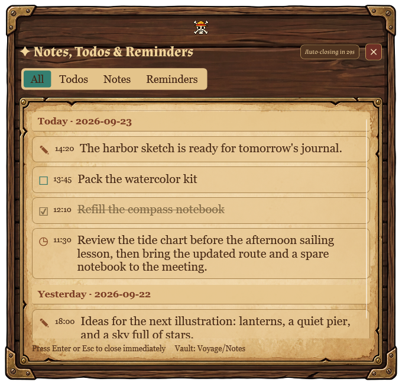
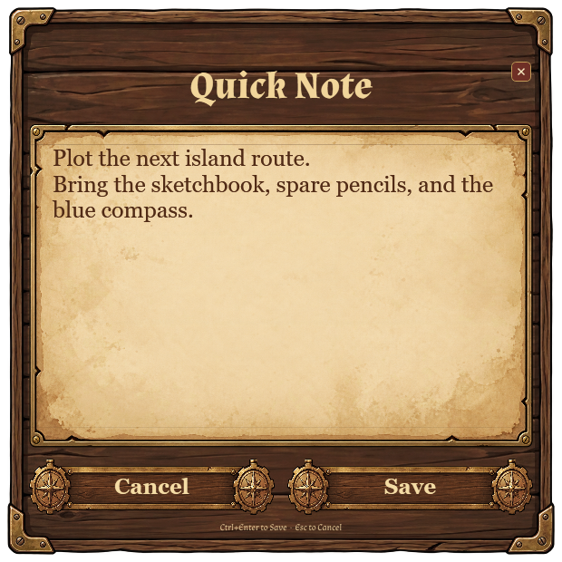
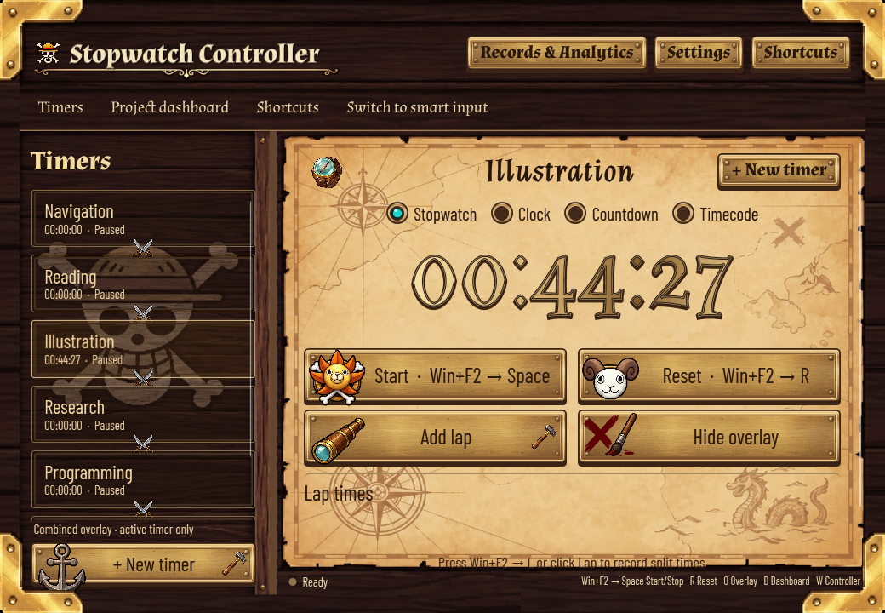

# ⏱️ Stopwatch Overlay

A transparent, always-on-top timer overlay and lightweight project time tracker for Windows — useful for focused work, video recordings, live streams, and presentations.

[](https://github.com/hosseinhayati128/stopwatch/releases/latest)
[](LICENSE)

**🌐 [Project Website](https://clemensv.github.io/stopwatch/)**

<p align="center">
  
</p>

<p align="center">
  <em>Pixel Deck Night with the Autumn Patchwork background. All screenshots below use fictional projects and sample activity—not personal records.</em>
</p>

---

## What It Does

Stopwatch Overlay places customizable timers on top of all your windows — including fullscreen apps and camera feeds. Run several timers independently, assign them to projects, and control the selected timer with global hotkeys without leaving the application where you are working.

### Features

- ⏱️ **Four timing modes** — Stopwatch, real-time clock, fixed or wall-clock countdown, and frame-accurate timecode
- 🧩 **Independent multi-timer workspace** — Create several floating timers, run them simultaneously, name them, and choose which timer receives commands
- 🗂️ **Combined timer view** — Share one compact overlay that shows only the active timer; cycle between timers without stopping the others
- 🏷️ **Automatic project tracking** — Assign an existing or new project to a timer and record every running work session automatically
- 📝 **Inline editable project records** — Expand records inside the dashboard, add past work manually, and correct completed records without changing active sessions
- 📊 **Project time dashboard** — Step through individual days or review 7 days, 30 days, and All time; compare project totals, timelines, and a project-filtered 12-month heatmap
- 🎨 **Six application themes** — Midnight, Daylight, Pixel Deck Night, Pixel Deck Day, Acanthus, and One Piece
- 🕰️ **Independent floating-clock themes** — Follow the application theme or choose one of nine clock styles (including the One Piece Navigator clock with custom layer opacities and three dark Acanthus variants), without changing your panels
- 📝 **Quick capture & notes (Win+F3)** — Quickly capture Todos, Notes, and Reminders from any application; automatically synced to your Obsidian vault grouped by date
- 📊 **Obsidian Analytics Dashboard, ActivityWatch Sync & Internet Monitoring** — Automated activity logging with ActivityWatch, background internet connection & Wi-Fi speed monitoring, and an interactive DataviewJS dashboard for Obsidian featuring dual synchronized timelines, project drill-downs, and per-project distraction rules (see [obsidian/](obsidian/))
- ✈️ **Telegram note integration** — Forward quick notes, todos, and reminders directly to distinct forum topics in your Telegram supergroup via Telegram Bot API
- 📋 **Floating notes viewer** — Floating popup (Win+F3 → 4) with tabs for All, Todos, Notes, and Reminders, auto-close countdown, and keyboard dismissal
- 🔤 **Custom typography & UI scaling** — Granular text scaling (75%–175%), colors, and panel overrides via Settings → Fonts & colors, plus whole-page UI scaling (70%–125%)
- 🧵 **Tiled background library** — Choose from nine bundled seamless patterns or import a JPG, PNG, or BMP; the selection, strength, and managed custom copy survive restarts
- 🖌️ **Deep overlay customization** — Choose display, position, text and outline colors, font, format, size, thickness, opacity, and optional light ring
- 🖥️ **Multi-monitor and presentation tools** — Show timers on one or every display, keep them always on top, enable click-through, or hide overlays from screen capture
- 🖱️ **Direct overlay controls** — Click a timer to activate it; hover for close, pause/resume, and reset controls
- ⌨️ **Timer command mode** — Press Win+F2 then a single key (Space, R, O, L, C, N, T, X, P, D, W, E) to control timers, projects, and the dashboard from any application
- 🧠 **Smart countdown input** — Enter natural durations, clock times, dates, weekdays, months, or years with a live interpretation preview
- 💾 **Crash-safe recovery** — Restore timers, running/paused state, projects, laps, positions, and combined/separate presentation after restart, shutdown, or a crash
- 🚀 **Desktop integration & configurable close** — Start with Windows, choose whether the close button (X) asks, minimizes to tray, or exits completely, and exit anytime from the tray menu
- 🎬 **Recording helpers** — Lap times, optional REC indicator, blinking colon, auto-show behavior, and capture protection

## Interface previews

### Settings: your panels and clock, styled independently

<p align="center">
  
</p>

Choose the application and floating-clock themes separately, then adjust text, font, size, background opacity, and more. Your custom values stay yours when switching themes.

<details>
<summary>See the Pixel Deck Night light-ring settings</summary>

<p align="center">
  
</p>

</details>

### Analytics with a populated project history

<p align="center">
  
</p>

The examples use a fictional year of varied work sessions. Totals, charts, overlapping timer lanes, and the heatmap are calculated by the actual application.

<details>
<summary>See the Midnight timeline and project records</summary>

<p align="center">
  
</p>

</details>

### Quick capture and notes: Obsidian-integrated Todos, Notes & Reminders

<p align="center">
  
</p>

<p align="center">
  <em>The floating Notes Viewer (Win+F3 → 4) displaying saved entries grouped by date, completed checkboxes, and category filter tabs.</em>
</p>

<details>
<summary>See the Quick Note entry popup</summary>

<p align="center">
  
</p>

</details>

### Same workspace, different themes

Pixel Deck Night is shown at the top of this page. Both Pixel Deck variants use Autumn Patchwork in these examples. Here are the other five panel themes; select an image to view it at full size.

<table>
  <tr>
    <td align="center"><strong>Midnight</strong><br><a href="docs/screenshots/controller-midnight.png"></a></td>
    <td align="center"><strong>Daylight</strong><br><a href="docs/screenshots/controller-daylight.png"></a></td>
  </tr>
  <tr>
    <td align="center"><strong>Pixel Deck Day</strong><br><a href="docs/screenshots/controller-pixel-deck-day.jpg"></a></td>
    <td align="center"><strong>Acanthus</strong><br><a href="docs/screenshots/controller-acanthus.png"></a></td>
  </tr>
  <tr>
    <td align="center" colspan="2"><strong>One Piece</strong><br><a href="docs/screenshots/controller-one-piece.png"></a></td>
  </tr>
</table>

<details>
<summary>Compare the eight floating-clock styles</summary>

<p align="center">
  
</p>

The timer stays above the project name. Close, pause/resume, and reset appear in a separate hover toolbar. Background opacity does not fade the text or controls.

</details>

### Transparent floating clocks

<p align="center">
  
</p>

Fade just the clock's background—or remove it completely—while keeping the timer, project name, and controls readable. The checkerboard is a sample backdrop, not part of the clock.

These are compact renders of the real WPF interface with synthetic data. To regenerate them without touching your saved history, see the [screenshot renderer](tools/ReadmeScreenshots/README.md).

---

## Download & Install

1. **Download** the latest Windows ZIP from the **[Releases page](https://github.com/hosseinhayati128/stopwatch/releases/latest)**
2. **Extract** the ZIP to any folder, for example:
   ```
   C:\Tools\StopwatchOverlay\
   ```
3. **Run** `StopwatchOverlay.exe` — no installer needed

> **Tip:** Pin it to your taskbar or create a desktop shortcut for quick access.

### .NET Runtime Requirement

The standard build requires the .NET 10 Desktop Runtime. The portable,
self-contained release includes the runtime and does not require a separate install.

| Windows Version | Runtime |
|---|---|
| **Windows 11** | Install the [.NET 10 Desktop Runtime](https://dotnet.microsoft.com/download/dotnet/10.0/runtime) for the standard build |
| **Windows 10** | Install the [.NET 10 Desktop Runtime](https://dotnet.microsoft.com/download/dotnet/10.0/runtime) for the standard build |
| **Portable release** | No separate runtime required |

---

## How to Use

1. Launch **StopwatchOverlay.exe** — choose a project for the first timer or leave it unnamed
2. Click **▶ Start** (or press **Win+F2 → Space**) to start the timer
3. The overlay is shown automatically; press **Win+F2 → O** whenever you want to hide or show the active timer
4. Choose your target **screen** and **position** from the dropdowns
5. Open **Settings → Appearance** to choose application and floating-clock themes independently, then customize the background, clock colors, font, size, and opacity
6. **Drag** the overlay with your mouse for pixel-perfect placement

When you click the controller's close button (**X**), Stopwatch Overlay prompts you to choose whether to minimize to the notification area (keeping overlays, timers, and shortcuts active) or close the application completely. You can check "Remember my choice" or adjust this anytime in **Settings → Application**.

Press **Win+F2 → N** or click **+ New timer** in the controller to create another timer. The project chooser opens first: select an existing project, use the small **+** button to add one, or leave **Select a project** unchanged to create an unnamed timer. Cancel leaves your existing timers unchanged. Each timer can run independently. Click an overlay or press **Win+F2 → T** to make that timer active; the regular timer shortcuts then affect only the active timer.

In combined mode, all open timers share one floating overlay. Pressing **Win+F2 → T** selects the next active timer and updates the shared overlay.

Press **Win+F2 → P** to assign the active timer to an existing project or add a new project name. Once that named timer is running, the app records its work time automatically.

### Quick Capture & Note Taking (`Win+F3`)

Stopwatch Overlay includes a global quick-capture system that writes directly to Markdown files inside your **Obsidian** vault, with optional automatic forwarding to **Telegram**:

1. Press **Win+F3** (configurable in **Keyboard Shortcuts**) to open the Note Command Mode hint overlay.
2. Press one of the shortcut keys to open a dedicated floating capture window or viewer:
   - **1** (or **T**): **Add Todo** — creates an interactive `- [ ] HH:mm text` item in `Notes/Todos.md`
   - **2** (or **N**): **Quick Note** — creates a `- **HH:mm** text` entry in `Notes/Notes.md`
   - **3** (or **R**): **Add Reminder** — creates a `- [ ] HH:mm ⏰ text` reminder in `Notes/Reminders.md`
   - **4** (or **V** / **O**): **View Notes** — opens the 30-second floating viewer popup
   - **Escape**: Cancel without action
3. In the entry popup, write your note and press **Ctrl+Enter** to save directly to Obsidian, or **Escape** to cancel. If no vault folder is configured yet, the app prompts you to pick your Obsidian vault folder.
4. Notes are automatically grouped and separated under date headers (`## yyyy-MM-dd`) in your vault's `Notes/` folder.
5. The **Notes Viewer** (`Win+F3 → 4`) displays your captured entries sorted chronologically, lets you switch between **All**, **Todos**, **Notes**, and **Reminders**, automatically counts down to close after 30 seconds, and dismisses immediately with **Enter** or **Escape**.

### Telegram Forwarding for Notes, Todos & Reminders

Stopwatch Overlay can automatically forward captured notes, todos, and reminders to your Telegram supergroup:

1. Open **Settings → Telegram** and check **Enable Telegram sync for notes, todos, and reminders**.
2. Enter your **Bot Token** (obtained from [@BotFather](https://t.me/BotFather)).
3. Enter your **Group / Supergroup Chat ID** (e.g. `-1001234567890`).
4. Optionally enter the **Topic ID** for each category (Quick Notes, Todos, Reminders) to route messages into separate forum topics.
5. Click **Test Connection** to verify your bot token with Telegram (`getMe`) and send a test message to ensure the bot has permission to post in your group.

> **Tip: Finding your Supergroup Chat ID and Topic ID in Telegram**
> 1. In Telegram Desktop or Mobile, right-click (or tap and hold) any message inside the target forum topic and select **Copy Message Link**.
> 2. The link format is `https://t.me/c/<GROUP_ID>/<TOPIC_ID>/<MESSAGE_ID>` (for example: `https://t.me/c/1987654321/42/105`).
> 3. **Chat ID:** Add `-100` in front of the `<GROUP_ID>` (e.g. `-1001987654321`).
> 4. **Topic ID:** The middle number (e.g. `42`). Leave blank to send to the General / main chat.

### Keyboard Shortcuts

Stopwatch Overlay uses a command-mode leader shortcut (default: **Win+F2**). Press **Win+F2**, then within 2 seconds press one of the following command keys. Executing a command keeps command mode open and gives you a configurable continuation window (default: 0.5 seconds, adjustable from 0.2 to 2.0 seconds in **Settings → Behavior** or in the **Keyboard Shortcuts** dialog) to press another command (e.g. **Win+F2** → **R** → **T** → **Space**). When you stop commanding or press **Escape**, command mode exits and the helper disappears:

| Key Sequence | Action |
|---|---|
| **Win+F2 → Space** | Start / stop the active timer |
| **Win+F2 → R** | Reset the active timer |
| **Win+F2 → O** | Show / hide the active timer's overlay |
| **Win+F2 → L** | Record a lap for the active timer |
| **Win+F2 → C** | Switch the active timer between its current mode and Clock |
| **Win+F2 → N** | Create a new timer and make it active |
| **Win+F2 → T** | Select the next active timer |
| **Win+F2 → X** | Close the active timer |
| **Win+F2 → P** | Choose, create, change, or clear the active timer's project |
| **Win+F2 → D** | Open the project time dashboard |
| **Win+F2 → W** | Open / restore and focus the stopwatch controller |
| **Win+F2 → E** | Edit active timer (adjust time value, start time, pause state, or discard from records) |
| **Escape** | Cancel command mode without action |


#### Note & Quick Capture Shortcuts (`Win+F3`)

| Key Sequence | Action |
|---|---|
| **Win+F3 → 1** (or **T**) | Open Add Todo popup |
| **Win+F3 → 2** (or **N**) | Open Quick Note popup |
| **Win+F3 → 3** (or **R**) | Open Add Reminder popup |
| **Win+F3 → 4** (or **V** / **O**) | Open floating Notes Viewer overlay |
| **Escape** | Dismiss note command menu |
| **Ctrl+Enter** | Save and close in entry popup |

Additionally, dedicated direct global shortcuts are available:
- **Win+Shift+F2** (configurable): **Open controller** — opens or restores and brings the stopwatch controller window to the foreground (including from the system tray).
- **Win+Shift+F7** (configurable): **Show active overlay** — reveals the active timer's floating overlay if hidden without toggling it off, changing timer running state, or triggering auto-start.

Clicking an overlay selects its timer. Hovering over an interactive overlay reveals close, pause/resume, and reset buttons. When **click-through mode** is enabled, mouse interaction with overlays—including selection, dragging, and hover controls—is disabled; global keyboard shortcuts continue to work.

### Project time tracking

A timer's name is also its **project name**. New timers may begin unnamed, which keeps their time out of reports. Use **Win+F2 → P** to assign, change, or clear the active timer's project. Starting a named timer begins a work session for that project. Pausing, stopping, closing, or clearing the project ends its current session. Changing a non-zero timer to another project saves the old project segment, resets the timer for the new project, and preserves whether it was running or paused. Changing a reset/zero timer only changes its assignment, so it begins from scratch when started.

Open the dashboard with **Win+F2 → D**. Use the day arrows to move through previous dates, select **Day** to return to today, or choose **Last 7 days**, **Last 30 days**, and **All time**. Each view includes:

- total tracked time, session count, project count, and currently active sessions
- horizontal time-by-project bars and daily totals
- a 24-hour project timeline for each local calendar day
- a 53-week activity heatmap whose squares open the selected day's statistics

Use the dashboard's **Project** filter to switch every card, chart, timeline, heatmap, and record list between **All projects** and one specific project. **Project records** is collapsed by default near the bottom of the dashboard; expand it to inspect the records that overlap the selected period. The **Add record** button remains visible while the list is collapsed.

The inline record list shows each selected-period portion in local time and lets you edit any completed record or permanently delete it after reviewing a confirmation. Editing always opens the complete saved record, even when only part of it falls inside the selected day or range. A currently running record remains visible but is locked; pause its timer first if you need to correct or delete it. Choose **All time** to browse the complete history. Manual changes use the same crash-safe project-history storage as automatically tracked sessions.

Every timer is tracked independently, so separately running project timers can record overlapping sessions. Dashboard timer-time totals add simultaneous sessions together rather than de-duplicating them. Unnamed timers continue to work normally but do not add project history.

Project history is saved locally under `%APPDATA%\StopwatchOverlay` and survives application restarts, computer shutdowns, and crashes. A named timer that is restored in its running state continues the same work session across the time the app was closed.

### Automatic recovery

The app restores all timer sessions when it starts again, including their running or paused state, names, laps, modes, overlay visibility and positions, combined/separate presentation, and the active timer. Timers that were running continue to account for the time while the app or PC was off; paused timers return at their exact saved time.

Recovery and project-history data are stored locally under `%APPDATA%\StopwatchOverlay`. Important actions are checkpointed immediately, while pending text, slider, and checkbox edits are written atomically by a one-second save timer. The timer does not keep writing while nothing has changed. After an abrupt process or power failure, at most roughly one second of the latest UI edits may be missing.

### Modes

| Mode | Description |
|---|---|
| **Stopwatch** | Elapsed time with start / stop / reset |
| **Clock** | Real-time clock (optional blinking colon) |
| **Countdown** | Counts down by a fixed duration, or to a wall-clock time (HH:MM:SS) via the Duration / Until-clock-time toggle; continues into negative. Also supports **smart text input** (see below) |
| **Timecode** | Frame-accurate display (HH:MM:SS:FF) |

### Smart countdown input

In Countdown mode, use the menu (**Switch to smart input** / **Switch to classic input**) to swap the spinner boxes for a single text field that parses natural durations, times, and dates. The choice is remembered between launches, and a live preview shows the interpreted result as you type.

**Durations**

| Type | Examples |
|---|---|
| Plain number = minutes | `5` → 5 min |
| Units (singular, plural, short) | `30 seconds`, `5m`, `7 hours`, `3d`, `25 weeks`, `6mo`, `2 years` |
| Combined | `5 minutes 30 seconds`, `1h30m`, `7h15m` |
| Decimal (with a unit) | `5.5 minutes` → 5m30s, `1.5 hours`, `0.5 years` → 6 months |
| Colon / dot separator | `5:30` → 5m30s, `7:15:00`, `5.30`, `7.15.00` |

**Times of day** (counts down to the next occurrence; rolls to tomorrow if already passed)

| Type | Examples |
|---|---|
| 12-hour meridiem | `2 pm`, `2:30 pm`, `2:30:15 pm`, `5am` (no space) |
| 24-hour (needs a clock prefix) | `until 14:30`, `till 9:00`, `c 20:30`, `wc 20h30`, `c 20h` |

**Dates & weekdays** (a bare date with no time = midnight)

| Type | Examples |
|---|---|
| Relative | `today`, `tomorrow` |
| Weekday (next occurrence) | `monday`, `mon`, `wednesday`, `wed` |
| Calendar date | `january 1`, `jan 1`, `1 january`, `1 jan`, `1/1`, `01/01` |
| Date + time (either order) | `jan 1 at 2 pm`, `2 pm on january 1`, `tomorrow 9 am`, `2 pm wednesday` |

> The `c` / `wc` / `until` / `till` prefixes force clock-time reading, so a bare `20:30` (a duration = 20m30s) can be entered as a 20:30 clock time via `c 20:30`.

---

## Tips

- Background patterns repeat across the controller, reports, dialogs, and floating clock; adjust pattern strength separately from clock opacity
- Text outlines keep the timer readable on any background
- You can hide the overlay while keeping the timer running
- Multiple timers can continue counting at the same time; "active" only means the one that receives commands
- Use **click-through mode** so the overlay doesn't interfere with your work; use hotkeys to control it while click-through is enabled

---

## For Developers

See [DEVELOPERS.md](DEVELOPERS.md) for build instructions, architecture details, and contribution guidelines.

## License

[MIT](LICENSE)

The bundled sample background images were supplied separately by the project owner and are not licensed under the repository's MIT license. Confirm that you have the necessary rights before redistributing those image assets.
